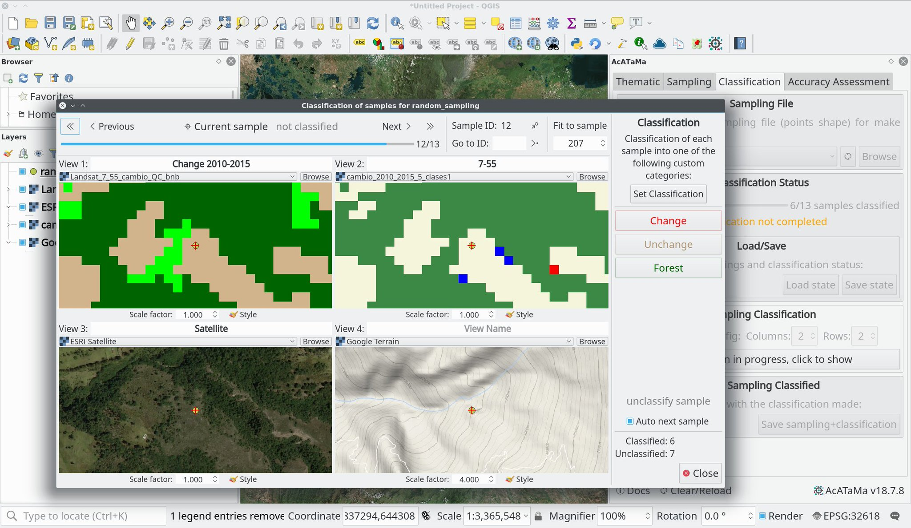

# AcATaMa #

The AcATaMa is a Qgis plugin for Accuracy Assessment of Thematic Maps. It was designed mainly for: to assess the accuracy of thematic maps, to estimate areas of the map classes, sampling design/classification and others.

Read more in: [https://smbyc.github.io/AcATaMa](https://smbyc.github.io/AcATaMa)

## Installation

The plugin can be installed using the QGIS Plugin Manager, go into Qgis to `Plugins` menu and `Manage and install plugins`, in `All` section search for `AcATaMa`.

The plugin will be available in the `Plugins` menu and `Plugins toolbar`.

## Source code

The official version control system repository of the plugin:
[https://github.com/SMByC/AcATaMa](https://github.com/SMByC/AcATaMa)

The home plugin in plugins.qgis.org: [https://plugins.qgis.org/plugins/AcATaMa/](https://plugins.qgis.org/plugins/AcATaMa/)

## Issue Tracker

Issues, ideas and enhancements: [https://github.com/SMByC/AcATaMa/issues](https://github.com/SMByC/AcATaMa/issues)

## About us

AcATaMa was developing, designed and implemented by the Group of Forest and Carbon Monitoring System (SMByC), operated by the Institute of Hydrology, Meteorology and Environmental Studies (IDEAM) - Colombia.

Author and developer: *Xavier Corredor Ll.*  
Theoretical support, tester and product verification: SMByC-PDI group

### Contact

Xavier Corredor Ll.: *xcorredorl (a) ideam.gov.co*  
SMByC: *smbyc (a) ideam.gov.co*

## How to cite

Llano, X. C. (2019). AcATaMa - QGIS plugin for Accuracy Assessment of Thematic Maps, version XX.XX, https://plugins.qgis.org/plugins/AcATaMa/.

## License

AcATaMa is a free/libre software and is licensed under the GNU General Public License.