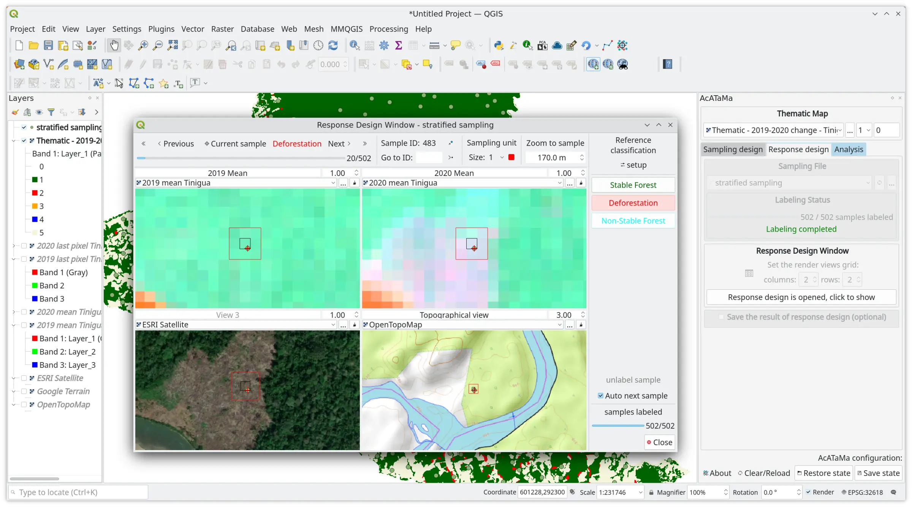
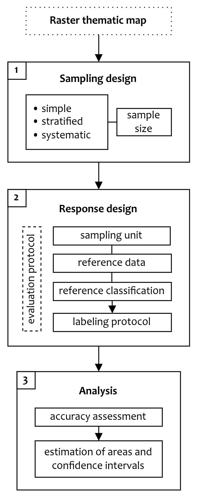

<p align="center"></p>
<h1 align="center">AcATaMa</h1>
<p align="center">
<a href="https://plugins.qgis.org/plugins/AcATaMa/"></a>
<a href="https://github.com/SMByC/AcATaMa/actions"></a>
<a href="https://www.gnu.org/licenses/gpl-3.0"></a>
<br>
<b>Documentation:</b> <a href="https://smbyc.github.io/AcATaMa">https://smbyc.github.io/AcATaMa</a><br>
<b>Paper:</b> <a href="https://doi.org/10.1016/j.acags.2026.100389">https://doi.org/10.1016/j.acags.2026.100389</a><br>
</p>

AcATaMa (Accuracy Assessment of Thematic Maps) is an open-source QGIS plugin designed to provide comprehensive support for accuracy assessment and sample-based area estimation of raster thematic maps. The primary goal of AcATaMa is to equip users with the necessary tools to comply with international guidance and best practices for sampling design, estimation of land category areas and changes, and map accuracy assessment.

AcATaMa has been adopted worldwide for diverse applications including deforestation monitoring, land-cover classification and change analysis, environmental and ecological studies, wildfire monitoring, water and watershed analysis, and agricultural research.

<div align="center">

</div>

The plugin integrates three fundamental components: **sampling design** (supporting simple random, stratified random, and systematic sampling), **response design** (providing a multi-window interface for reference data interpretation), and **analysis** (generating error matrices, accuracy metrics, and area-adjusted estimates with uncertainty quantification).

<div align="center">

</div>

## Install

AcATaMa is available from the official QGIS Plugin Repository. To install it:

1. Open QGIS and go to `Plugins` → `Manage and Install Plugins…`.
2. In the search bar, type `AcATaMa` and click `Install Plugin`.
3. Once installed, activate the plugin via the `Plugins` menu or `Plugins toolbar`.

> **Note:** AcATaMa is compatible with both QGIS 3 (3.36+) and QGIS 4.

### External Python libraries

The AcATaMa plugin package does not bundle its external Python libraries. When Dask is not already available, AcATaMa downloads `extlibs.zip` from the matching GitHub release and installs it into the QGIS profile plugin directory.

For offline installations, download `extlibs.zip` from the same AcATaMa release as the plugin and extract its contents into the plugin `extlibs` directory, for example `QGIS3/profiles/default/python/plugins/AcATaMa/extlibs`.

## Packaging

Package directly with qgis-plugin-ci. The tracked `AcATaMa/resources.py` module
provides QGIS 3.36+ and QGIS 4 / Qt6-compatible resources, while
`AcATaMa/icons/resources.qrc` remains the icon source. The qrc file lives
inside the icons folder on purpose: qgis-plugin-ci only compiles qrc files at
the top level of the plugin folder, and its compiled `resources_rc.py` is
PyQt5-only, which is rejected by the QGIS plugin repository Qt6 checks.

```bash
qgis-plugin-ci package -c 26.7
```

The `-c` option allows uncommitted changes during packaging.

After changing icons, regenerate the resources module with:

```bash
make -C AcATaMa/icons resources
```

## Citation

Please cite it as:

> Llano, X. C., Vergara, L. K., Arias, J. A., & Galindo, G. (2026). AcATaMa: A QGIS plugin for accuracy assessment and area estimation. Applied Computing and Geosciences, 31, Article 100389. https://doi.org/10.1016/j.acags.2026.100389

BibTeX:

```bibtex
@article{LLANO2026100389,
title = {AcATaMa: A QGIS plugin for accuracy assessment and area estimation},
journal = {Applied Computing and Geosciences},
volume = {31},
pages = {100389},
year = {2026},
issn = {2590-1974},
doi = {10.1016/j.acags.2026.100389},
url = {https://www.sciencedirect.com/science/article/pii/S259019742600073X},
author = {X.C. Llano and L.K. Vergara and J.A. Arias and G. Galindo},
}
```

## About Us

AcATaMa was developed by the Forest and Carbon Monitoring System (SMByC) at the Institute of Hydrology, Meteorology and Environmental Studies (IDEAM) in Colombia. SMByC is responsible for measuring and ensuring the accuracy of official national forest figures.

- [Xavier C. Llano](https://github.com/XavierCLL) - Author and lead developer
- [SMByC-PDI team](https://github.com/SMByC) - Development support and testing

This project was fully funded by the SMByC-IDEAM, Colombia.

## Contributing

We welcome contributions! Please see our [Contributing Guidelines](CONTRIBUTING.md)
