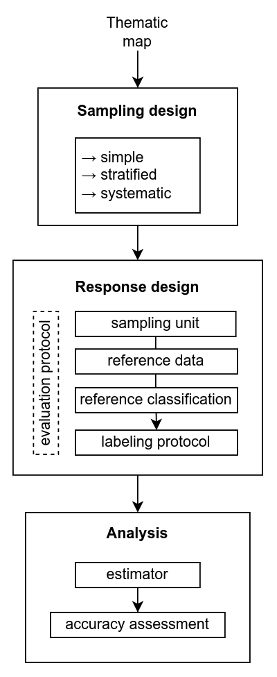

# AcATaMa #

> [!WARNING]  
> The latest versions of AcATaMa (>=24.10) is not compatible with QGIS 3.28 or older versions due to changes in a QGIS 
> function introduced in QGIS 3.30 (see issue #22). Please update QGIS to at least the LTR version (recommended) or the 
> latest version.

AcATaMa is a powerful and complete Qgis plugin for accuracy assessment. It provides comprehensive support for sampling,
response design and estimation within a design-based inference framework. The primary goal of AcATaMa is to equip users
with the necessary tools to comply with international guidance and best practices for sampling design, estimation of
land category areas and changes, and map accuracy assessment.

The plugin supports accuracy assessment for any thematic map across diverse use cases. A common application is in
remote sensing, particularly for land use and land cover classification, environmental monitoring, urban planning,
forestry, agriculture, and more. However, AcATaMa is not limited to these applications; some modules, such as sampling
and labeling, can be used independently for other user cases.

To ensure a good accuracy assessment AcATaMa provides three components: **sampling design**, used to select the
reference sample; the **response design**, which allows the evaluation protocol, and finally, the **analysis**
procedures with different estimators:

> Read more in the documentation here: [https://smbyc.github.io/AcATaMa](https://smbyc.github.io/AcATaMa)

## Source code

Source code, issue tracker, QA and ideas:[https://github.com/SMByC/AcATaMa](https://github.com/SMByC/AcATaMa)  
The home plugin in
plugins.qgis.org: [https://plugins.qgis.org/plugins/AcATaMa/](https://plugins.qgis.org/plugins/AcATaMa/)

## Quality Assurance

AcATaMa has been manually tested with multiple real examples for all user cases in order to guarantee the quality of
the results.

## About us

AcATaMa was developing, designed and implemented by the Group of Forest and Carbon Monitoring System (SMByC), operated
by the Institute of Hydrology, Meteorology and Environmental Studies (IDEAM) - Colombia.

Author and developer: *Xavier C. Llano* *<xavier.corredor.llano@gmail.com>*  
Documentation, testers and product verification: *Gustavo Galindo, Jhonatan Andrés Arias, Katerine Vergara*

## How to cite

Llano, X. (version_year), SMByC-IDEAM. AcATaMa - QGIS plugin for Accuracy Assessment of Thematic Maps, version XX.XX.
Available in https://github.com/SMByC/AcATaMa

## License

AcATaMa is a free/libre software and is licensed under the GNU General Public License.
