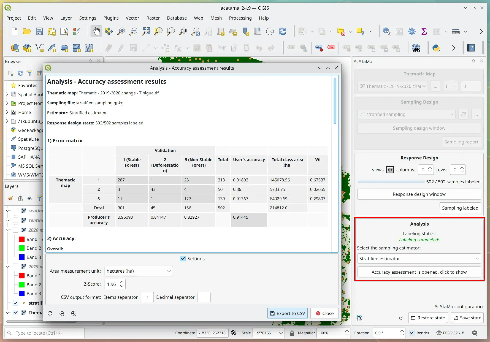

# Analysis

The main objective of the accuracy evaluation is the estimation of the area. It seeks to ensure that each land cover 
class is correctly classified, as well as the confidence intervals of the accuracy measurements for said cover classes. 
For this, the analysis component should focus on organizing and summarizing information to quantify accuracy. And later, 
estimate the accuracy and the area, from the sample data.

Accuracy assessment focuses on three types of analysis and parameters. The first at a global level, defined as general 
accuracy or Kappa coefficient. The second that focuses on the specific accuracy of the class and is classified as the 
accuracy of the user or the producer. And, the third, which corresponds to the estimation of the proportion of area by 
a class. In practice, the analysis should focus on easily interpretable accuracy measures, and thus the error matrix 
should reflect the area proportional representation of the study region. The main requirements for the analysis to 
satisfy the criterion of statistical rigor involve using consistent estimators and quantifying the variability of the 
accuracy and area estimates, using standard errors or confidence intervals.

## Estimators

The area estimate should be based on the available reference classification for the pixels in the sample; so it is 
essential to estimate the sample area (Stehman & Foody, 2019).

(in progress)

## Accuracy assessment

### Error matrix

The confusion matrix is the most widely used method for assessing accuracy. The matrix should remain a cornerstone of 
the analysis protocol due to its ease of interpretation and valuable descriptive information. Typically, the map data 
is arranged in rows and the reference data is arranged in columns in the matrix. The values arranged on the diagonal of 
the confusion matrix indicate the degree of agreement between the two data sets.

This matrix is essential for the analysis of the area and variance estimators. The row and column totals of the 
population error matrix are important because they quantify the distribution, by area, of different land cover classes. 
The row totals represent the proportion of area of each class, according to the map classification. On the other hand, 
the totals of the columns represent the proportion of area, according to the reference classification. Accuracy 
assessment focuses on three types of analysis and parameters. The first at a global level, defined as general accuracy 
or Kappa coefficient. The second that focuses on the specific accuracy of the class and is classified as the accuracy 
of the user or the producer. And, the third, which corresponds to the estimation of the proportion of area by a class.

### Accuracy

* **Overall accuracy**: The global accuracy has a direct interpretation in terms of area, since it represents the proportion of area correctly 
classified. Overall accuracy hides important information specific to each class. The limitation to overall accuracy is 
not how it weights or represents class-specific information, but rather that it does not provide class-specific information.

* **User accuracy**: In it, the number of correctly classified sampling units (nii) in a class is divided by the total number of sampling 
units of that same class in the map (nk+). In this case, this accuracy is associated with the measurement of commission 
errors, which are defined as the inclusion of a map area in a land cover class in which that area should not be included.

* **Producer accuracy**: Where the number of correctly classified sampling units (njj) in a class is divided by the total number of sampling 
units in the reference data n+j, for that class. Omission errors occur when an area is excluded on the map from the 
land cover class to which it should belong. 

Errors of omission and errors of commission can be problematic to different degrees depending on the goals of a given 
application of the map. Therefore, it is advisable to have separate estimates of user and producer accuracies. If 
general measures are reported, they must be accompanied by specific measures of each class. In any case, the presented 
formulas can only be applied if they evaluate the same map classes in the reference data. On the contrary, if other 
classes are classified, it is advisable to use the formulas proposed by Stehman S. V. (2014). (Stehman S.V., 2014). 
The variances of the general, user and producer accuracy are estimated with reference to the article Stehman & Foody, 2019

### Accuracy matrix of estimated area proportions

* **User´s accuracy matrix of estimated area proportion**: User´s accuracy is the proportion of the area mapped as a particular category that is actually that category "on the ground" where the reference classification is the best assessment of ground condition. User's accuracy is the complement of the probability of commission error (Olofsson et al. 2013). The user´s accuracy is calculated by the equation (2) in Olofsson et al. (2014). In the report, the user´s accuracy for each class or category correspond to the diagonal of the matrix, that means, the fields in which the class of the thematic map and the classified category (reference) are equals.

* **Producer´s accuracy matrix of estimated area proportion**: Producer's accuracy is the proportion of the area that is a particular category on the ground that is also mapped as that category. Producer's accuracy is the complement of the probability of omission error (Olofsson et al. 2013). The producer's accuracy is calculated by the equation (3) in Olofsson et al. (2014). In the report, the accuracy for each class or category correspond to the diagonal of the matrix, the fields in which the class of the thematic map and the classified category (reference) are equals.

### Error matrix of estimated area proportion

The absolute counts of the sample are converted into estimated area proportions using the equation (9) in Olofsson et 
al. (2014) for post-stratify simple or systematic sampling or stratified sampling with the map classes defined as the strata.

### Quadratic error matrix for estimated area proportion

Correspond to the standard error estimated by the equation (10) in Olofsson et al. (2014)

### Class area adjusted

The accuracy assessment serves to derive the uncertainty of the map area estimates. Whereas the map provides a single 
area estimate for each class without confidence interval, the accuracy estimates adjusts this estimate and also provides 
confidence intervals as estimates of uncertainty. The adjusted area estimates can be considerably higher or lower than 
the map estimates (FAO, 2016).

The estimated area for each class or stratum and the standard error of the estimated area is given by the equation (11) 
in Olofsson et al. (2014); they allow to obtain the confidence interval with the percent defined by the z-score value. 
AcATaMa calculate a 95% confidence interval (Z=1,96) by default, but you can modify the z-score value 
according to the desired percent (Settings options in the report of results).

Next >> [Examples](./examples)
