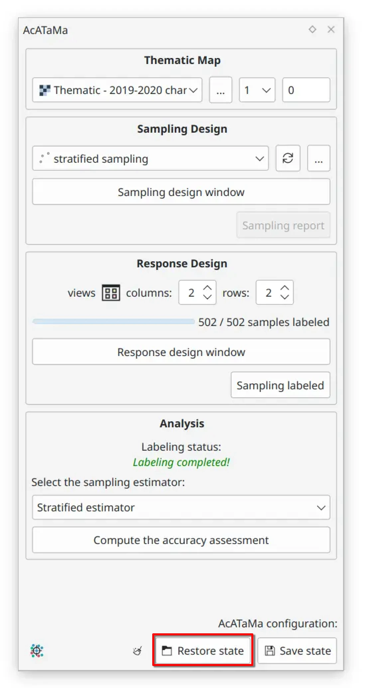

# Examples

> **Download** the examples in order to load them in Acatama and explore the configuration and results, you can find the zip [here](https://drive.google.com/uc?export=download&id=1dZwaxA67FbhXY9MZ62LNVMqd8ZPpGJeE)

> Load the examples using the Restore state function in Acatama: 

The examples were made with the forest land change map in Colombia for the year 2019-2020, the study area is the Tinigua 
National Natural Park an area with a high deforestation rate that is located on the border of the Colombian Amazon and 
the Andes mountains. The classes that are assessed in this thematic accuracy assessment are Stable Forest, Non-Stable 
Forest, and Deforestation.

The three types of sampling were carried out: simple random, systematic and stratified. For each sampling, 500 
evaluation points were chosen and Landsat images from 2019 and 2020 were used as reference data to identify the change 
in coverage. The Landsat satellite images are the primary input for evaluating thematic accuracy, and they are 
supplemented by a query of satellite image data from the Google Earth platform (not set in the examples, however we recommend 
having supplemental data by Google Earth Engine [plugin](https://plugins.qgis.org/plugins/ee_plugin/) based on your use 
case and needs)

The main goal of these exercises is to define the agreement between the forest change detection map and the manual 
classification by visually interpreting the reference data, which will result in an error matrix expressed in terms 
of the area relationship. The following table summarizes the response protocol specifications for all of the exercises proposed:

| Protocol specifications | Description                                                                                                                                                                                                                                         |
|-------------------------|-----------------------------------------------------------------------------------------------------------------------------------------------------------------------------------------------------------------------------------------------------|
| Reference Data          | Landsat 2019, 2020 and Google Earth images..                                                                                                                                                                                                        |
| Evaluation protocol     | One hectare is designated as a sampling unit, that is, 3x3 pixels                                                                                                                                                                                   |
| labeling protocol       | They are classified into four classes:  · Stable forest  · Non stable forest  · Deforestation  · As a labeling rule: if there is doubt about the pixel classification, the dominant class in the 9 neighboring pixels should be chosen. |

Finally, the results that are obtained when the sampling points are completed. This example presents the results with the different estimators, associated with the types of sampling such as 
simple random, systematic, stratified and post-stratified.
