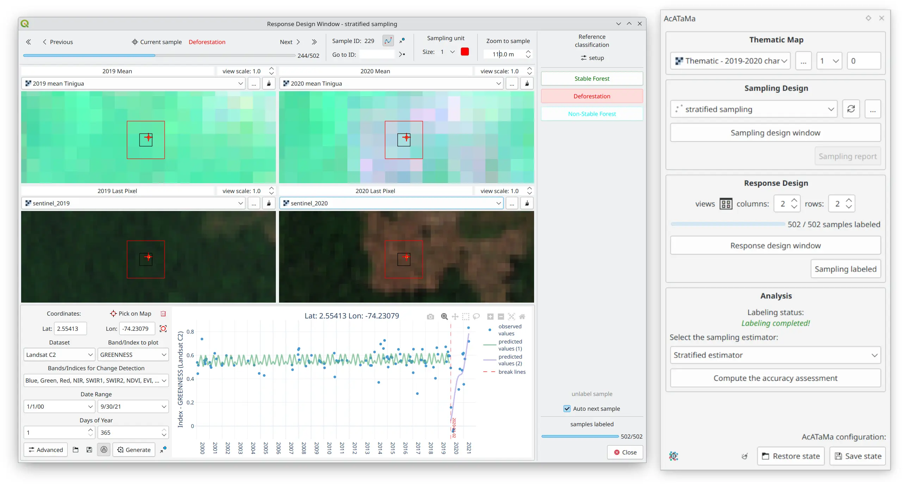

# AcATaMa

AcATaMa (sort for Accuracy Assessment of Thematic Maps) is a powerful and complete Qgis plugin for accuracy assessment 
designed for land use/land cover classification, including supervised/unsupervised classification or any thematic map. 
It provides comprehensive support for sampling, response design and estimation within a design-based inference framework. 
The primary goal of AcATaMa is to equip users with the necessary tools to comply with international guidance and best 
practices for sampling design, estimation of land category areas and changes, and map accuracy assessment.

> *Important:* AcATaMa with the version [22.10.23](https://github.com/SMByC/AcATaMa/releases/tag/22.10.23) has received 
> a major update. Check if you are using the latest version of the plugin, this documentation is based on that major update.

To ensure a good accuracy assessment AcATaMa provides three components: **sampling design**, used to select the reference 
sample; the **response design**, which allows the evaluation protocol, and finally, the **analysis** procedures with 
different estimators. AcATaMa provides several sampling designs and estimators, but also comprehensive support for the 
response design process. AcATaMa has been manually tested with multiple real examples for all user cases in order to 
guarantee the quality of the results, some of them have been implemented as 
[unit tests](https://github.com/SMByC/AcATaMa/actions/workflows/tests.yml).

AcATaMa implements equations, methodologies and recommendations from the following widely accepted papers, 
and we recommend reading as theoretical support and delving into the guide, protocol and recommendations for the entire 
process to calculate the accuracy assessment of a map, and how AcATaMa works:

+ *Stehman, S. V., & Czaplewski, R. L. (1998). Design and analysis for thematic map accuracy assessment: fundamental principles. Remote sensing of environment, 66(3), 311-326. [Link](https://doi.org/10.1016/S0034-4257(98)00010-8)*

+ *Stehman, S. V. (2013). Estimating area from an accuracy assessment error matrix. Remote Sensing of Environment, 202-211. [Link](https://doi:10.1016/j.rse.2013.01.016)*

+ *Stehman, S. V. (2014). Estimating area and map accuracy for stratified random sampling when the strata are different from the map classes. International Journal of Remote Sensing, 4923-4939. [Link](https://doi.org/10.1080/01431161.2014.930207)*

+ *Stehman, S. V., & Foody, G. M. (2019). Key issues in rigorous accuracy assessment of land cover products. Remote Sensing of Environment, 231, 1-23. [Link](https://doi.org/10.1016/j.rse.2019.05.018)*

+ *Olofsson, P., Herold, M., Stehman, S. V., Woodcock, C. E. & , M. A. Wulder. 2014. Good practices for estimating area and assessing accuracy of land change. Remote Sensing of Environment, 148:42–57. [Link](https://www.sciencedirect.com/science/article/pii/S0034425714000704)*

+ *Olofsson, P., Foody, G. M., Stehman, S. V. & C. E. Woodcock. 2013. Making better use of accuracy data in land change studies: Estimating accuracy and area and quantifying uncertainty using stratified estimation. Remote Sensing of Environment, 129:122–131. [Link](https://www.sciencedirect.com/science/article/pii/S0034425712004191?via%3Dihub)*

+ *Congalton, R. G., & Green, K. (2019). Assessing the Accuracy of Remotely Sensed Data Principles and Practices. Boca Raton, FL: Taylor & Francis Group. [Link](https://doi.org/10.1201/9780429052729)*

+ *Cochran, W. G. (1977). Sampling techniques . New York: John Wiley & Sons.*

Next >> [Overview](./overview)
