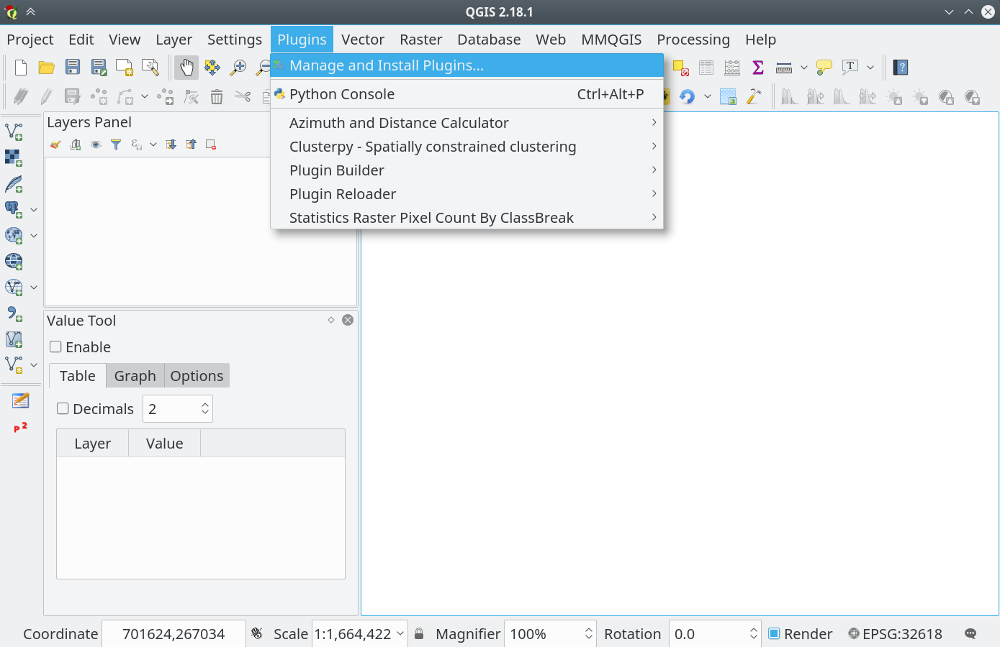
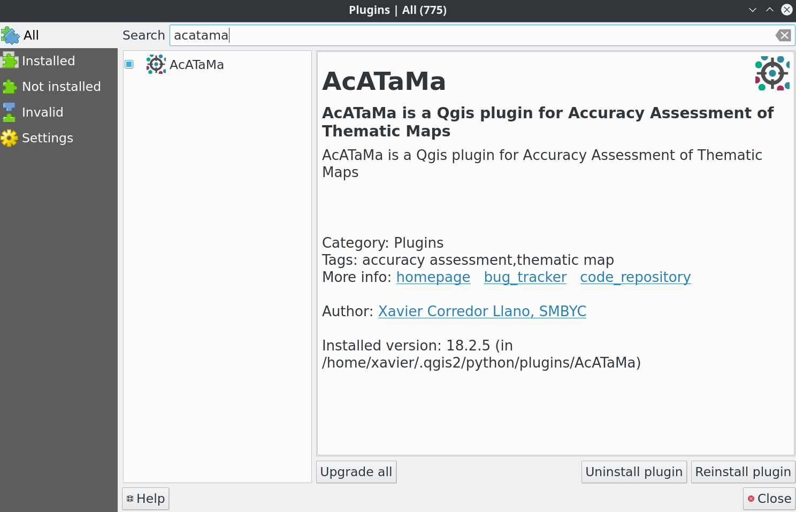
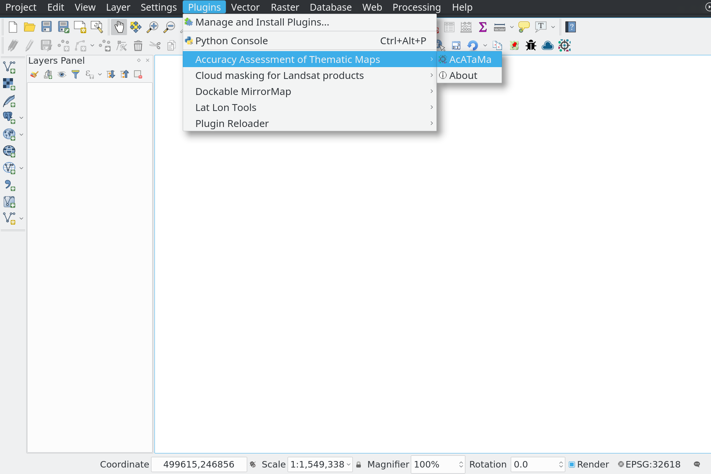

# Installation

The plugin can be installed using the QGIS Plugin Manager:

- Go into Qgis to `Plugins` menu and `Manage and install plugins`

    

- In `All` section search for `AcATaMa` click and press Install plugin

    

- The plugin will be available in the `Plugins` menu and `Plugins toolbar`

    
