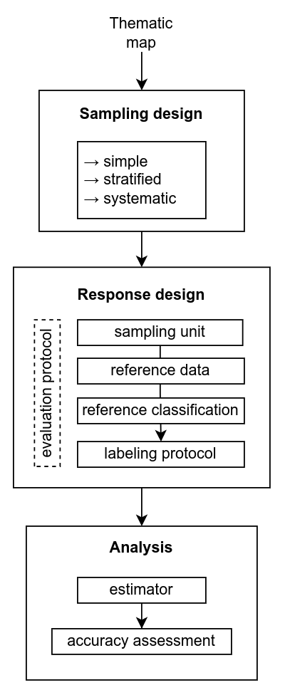

# Overview

In general terms, an accuracy assessment is a process of estimating a measure of map accuracy using a sample of
reference observations, and for that, we recommend follow these steps based on international guidance and best practices
used and recommended by researchers and different institutions:

The three basic components of accuracy assessment are the sampling design used to select the reference sample; the
response design, which allows obtaining the reference classification for each test unit and, finally, the estimation
and analysis procedures. Each of the components will be explained in the following pages.

Next >> [Thematic map](./thematic-map)