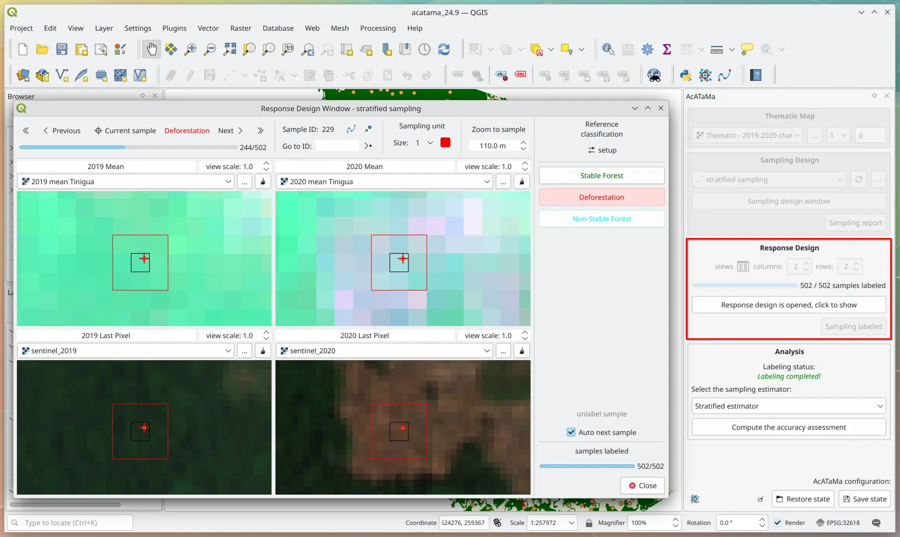
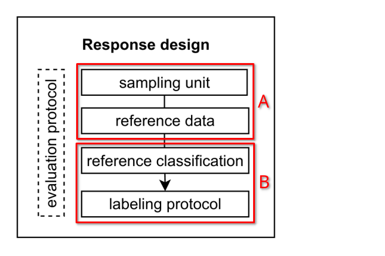
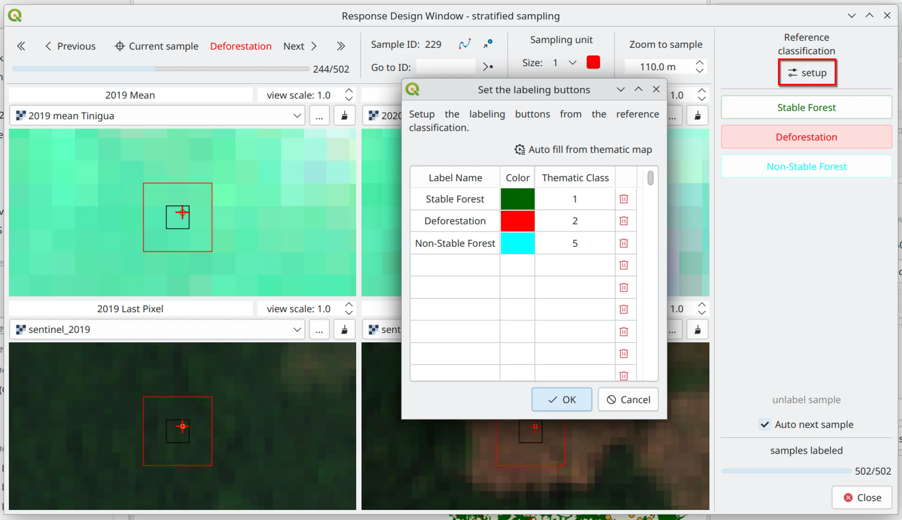
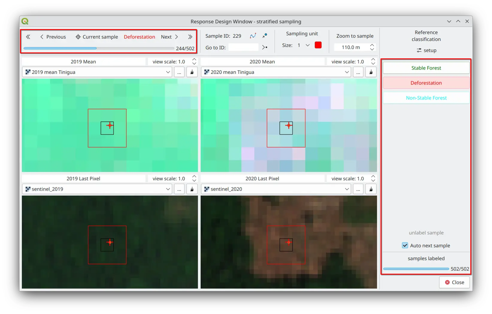

# Response Design

The responsive design is defined as the protocol for determining the baseline classification at the selected sample 
sites (Olofsson, et al., 2014). Conceptually it is useful to separate the response design into two components:

**A)** The evaluation protocol with the procedures used to gather information that contributes to the determination of the 
reference classification.

### Sampling unit

The sampling unit is a structure that defines a specified space that defines the basis for the comparison of the 
thematic map and reference data and with that defines the space for labeling protocol.

### Reference data

Collection of reference observations or other types of data sources characterized as having the most accurate available 
assessment of the “true” condition at the sample location, and with the help of the sampling unit space and the expertise 
of the evaluator, to contribute to the reference classification determination and the labeling protocol.

**B)** The labeling protocol that implies the classification of the sampling unit based on the information obtained from 
the evaluation protocol (Stehman & Czaplewski, 1998).

### Reference classification

Available assessment of the condition of a population unit. The classes available come from the thematic map, the 
evaluator must select the reference classes as a labeling buttons using the “Labeling setup” option in AcATaMa.

### Labeling protocol

The labeling protocol assigns a label from the reference classification (through labeling buttons) to the sampling unit, 
supported by the reference data and the evaluation protocol.

### Evaluation protocol

Procedures used to define a class from the reference classification to a sampling unit based on the space of the sampling 
unit and the experience of the evaluator with the help of reference data and observations.

At most of the cases (and recommend) the evaluation protocol use the reference classification to apply to the sampling 
unit and its space and not only to the sample itself (as a point unit). In some cases, the evaluator may visually scan 
the sampling unit and record qualitative observations that contribute to an eventual classification of the sampling unit. 
In other cases, the assessment protocol may specify the recording of species composition, canopy closure, or tree size 
distribution, or require other quantitative data necessary to distinguish the reference classification for that sampling 
unit (Stehman & Czaplewski, 1998).

Next >> [Analysis](./analysis)
