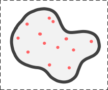
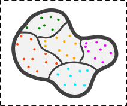
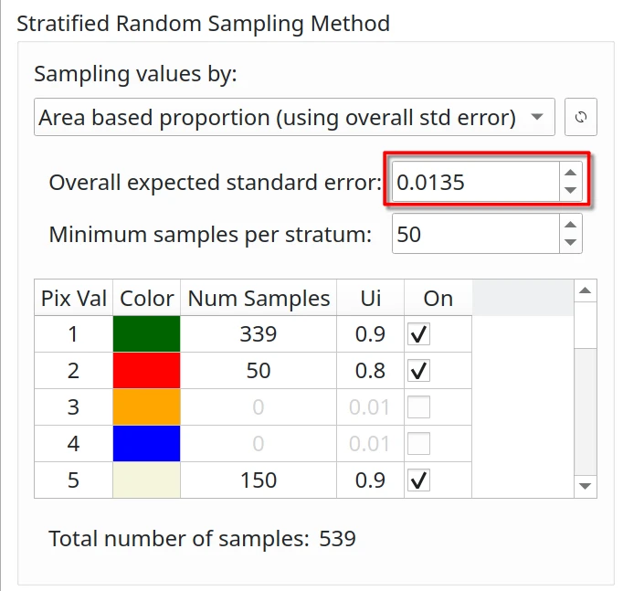
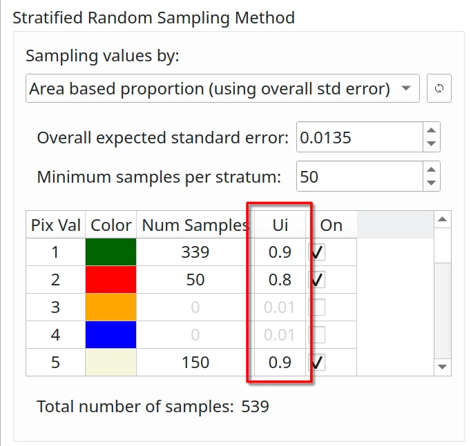

# Sampling Design

The sampling design is the protocol for selecting the subset of evaluation units for which the reference classification
is obtained. Choosing a sampling design also requires defining a sampling frame and sampling unit to serve as the basis
for accuracy assessment.

Another important quality in the sampling design is that it meets the criteria of reproducibility. For this, the key
characteristics that must be documented are the following:

1. Describe the randomization implemented in the selection of the sample;
2. Identify the information needed to estimate the inclusion probability or specify them;
3. Describe how the strata were constructed, the proportion of area in each stratum, specify the sampling design
   implemented within each stratum, and indicate the size of the sample assigned to each stratum;
4. Define the primary sampling unit (PSU) and the secondary sampling unit (SSU), indicate whether one-stage or two-stage
   sampling was implemented, and specify the sampling design implemented at each stage.

The Sampling Unit can be defined as the unit of comparison between the reference data and the map data. It is also
referred to as the fundamental unit upon which the accuracy assessment is based, as it connects the spatial location on
the map to the corresponding location on the ground. (Stehman & Czaplewski, 1998).

Sampling protocol is one of the most complex and important steps in assessing the accuracy of maps. The sampling
protocol is responsible for selecting the sampling units and, together with the analysis of its components, the
statistical inference is obtained.

Selecting the sampling design is crucial and could be based on the population/data type, what you are evaluating, or
your needs. At the moment we have implemented three main sampling designs: simple random, stratified random, and
systematic sampling and all are probability sampling designs. For example, use simple random for a population without
strata. Stratified random is commonly employed for sampling within each stratum of the classes of the stratified map.
And the systematic protocol to have some strata sampled systematically. But also we implemented post-stratification 
methods for simple random and systematic sampling to ensure that samples randomly generated are only on specific strata.

## Simple random sampling

It is appropriate if the sample size is large enough to ensure that all classes are adequately represented. It could be
useful to serve the needs of a wide group of users.

_**Advantages**_: It is extremely simple to use and adapts to the need to increase or decrease the sampling units.
Less complex statistical estimators compared to other sampling designs.

_**Disadvantages**_: Underestimates the less representative classes. Not well distributed spatially

## Stratified random sampling

It is useful for reporting results when strata are of interest and the precision of accuracy and area estimates need to
be improved. As a result, it is one of the most commonly used. It is used in conjunction with prior knowledge to
stratify the study area. This design is recommended by Olofsson et al. (2014) as a good practice option for ensuring 
that rare classes are well represented.

_**Advantages**_: It allows to increase the sample size of the less common classes. It lowers the standard errors of the
accuracy estimates for rare classes or if the proportions are very different between strata. Geographic stratification
could be used to ensure a good spatial distribution of the sample. It allows the option of using different sampling
designs in different strata.

_**Disadvantages**_: Stratification by geographic region does not result in a gain in precision. Only the evaluation of
the accuracy of the map that gives rise to the strata is allowed. Sampling with an optimal allocation leads to different
probabilities of inclusion, this makes it difficult to calculate the estimators

## Systematic random sampling

### Aligned systematic sampling

Distribute the sampling units equally for the entire study area. As long as the first sampling unit is randomly
selected, we can say that systematic sampling is random. Simplicity is highly attractive to end users. The variance 
depends on how the error is spatially distributed.

_**Advantages**_: It distributes the sampling units equitably throughout the study area. As long as the first sampling
unit is randomly selected, we can say that systematic sampling is random. Simplicity is highly attractive to end 
users. The variance depends on how the error is spatially distributed.

_**Disadvantages**_: If the errors are located in certain areas of the population, systematic sampling will have a lower
variance. The non-existence of an impartial estimator for calculating the variance. This aspect leads to an
overestimation of the variance. In the presence of uniformly distributed errors, the application is not desirable.

### Unaligned systematic sampling

The area is divided into smaller, regularly spaced regions, with a randomly chosen sample unit within each of these
regions. The sample units are evenly dispersed but not positioned. In order to minimize the effects of the periodicity
of errors.

_**Advantages**_: If the linearity of the error is present, it is less susceptible to error. The calculation of the
variance is acceptable and unbiased.

_**Disadvantages**_: Reduces the advantage of the spatial distribution of error and favors systematic sampling over
simple random sampling. The lack of an unbiased estimator.

---

## Sample size

For a statistically correct assessment of accuracy it is necessary to collect an adequate number of sampling units for
each class. In fact, the size of the sample will influence the precision with which the accuracy is estimated. Congalton
& Green (2009) point out that at least 50 sampling units should be collected for each land cover class. According to
Stehman (2001), a sample with 100 sampling units per class ensures that the accuracy can be estimated with a standard
deviation of no more than 0.05. Despite this aspect, the minimum value of the sampling units per land cover class could
vary depending on the importance (Congalton & Green, 2019) (Stehman & Foody, 2019)

### Sample size in simple and systematic sampling

Simple and systematic random sampling are easy and practical designs, they represent homogeneous and proportional
populations very well, and the sample size for each coverage or map class must be large enough to produce sufficiently
precise estimates of area. However, when there are small or rare areas compared to the total area such as deforestation,
stratified sampling is recommended. (Methods and Guidance from the Global Forest Observations Initiative, GFOI, 2020)

### Sample size in stratified sampling

For stratified sampling, Cochran (1977) provides the following sample size formula (Cochran, 1977 and Olofsson, et 
al., 2014)

Where N=number of units in the study region, S(ô) is the standard error of the expected global accuracy, Wi is the
mapped proportion of the area of class i, and Si is the standard deviation of stratum i and Ui is the accuracy
expected by class i. Since N is usually very large, the second term in the denominator of the above equation can be
discarded.

The user's accuracy (Ui) is the probability that a pixel classified as class i is actually class i. The user's accuracy 
is a measure of the reliability of the classification, in other words, the user's accuracy is the confidence for map 
classes. In general, the user's accuracy values are:

- 0.6 - 0.8: for unstable classes
- 0.8 - 0.95: for stable classes

For example, based on a study from Olofsson et al. (2014) assessing the accuracy of forest change, the user's accuracy 
values for the following classes could be:

- 0.6 - 0.7: forest gain (very unstable class)
- 0.7 - 0.8: deforestation (unstable class)
- 0.8 - 0.9: stable forest (stable class)
- 0.95: stable non-forest (very stable class)

Next >> [Response design](response-design.html)
