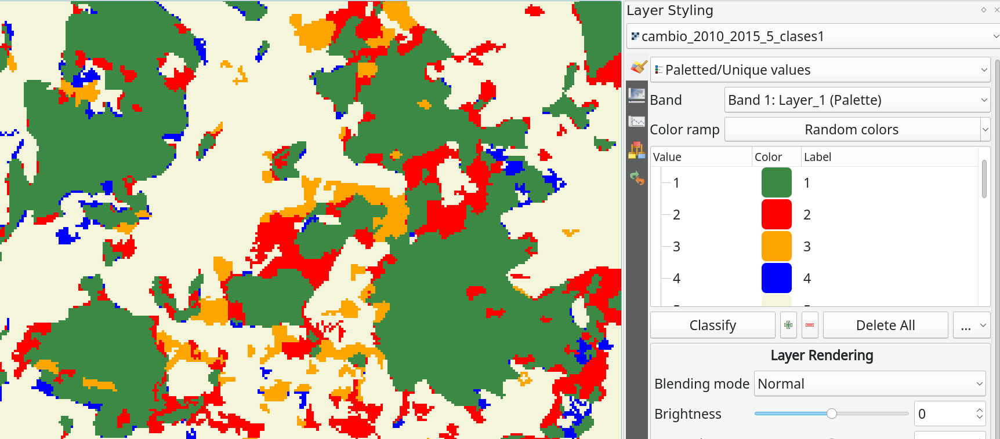
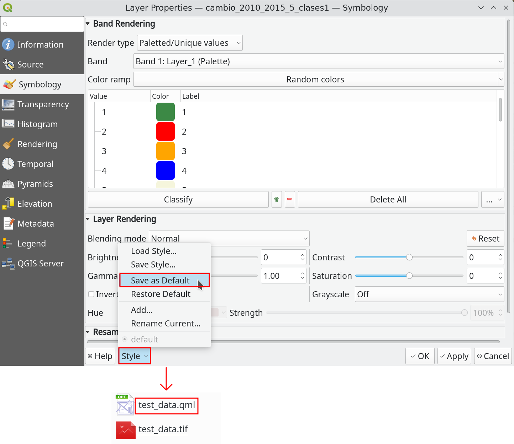

# Thematic Map

The thematic map is the raster layer that you want to quantify the quality of the data through the accuracy assessment 
protocol. It must be a categorical raster layer **with byte or integer as data type** with a specific pixel-value/color 
associated, otherwise AcATaMa will prompt the user to apply an automatic pixel-value/color, but this is temporal 
(unless you save it, see below).

There are two types of pixel-value/color associated accepted in AcATaMa (based on Qgis): *"Simgleband pseudocolor"* and 
*"Paletted/Unique values"* (recommended). If the layer don't have the color table as a metadata inside the file, we 
recommend set and save the pixel-value/color associated for the Thematic Map before work with it, you can save that 
style using the Qgis xml style file (see below) or saving the Qgis project. 

> *Important:* Clip the thematic map in your area of interest could be very important for the sampling design and the 
> accuracy assessment process, because the area by classes changes and some parts of AcATaMa depends on it.

Next >> [Sampling Design](./sampling-design)